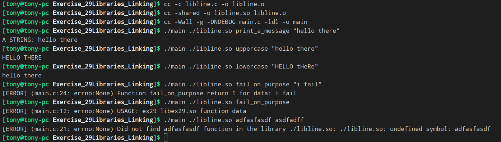

# 使用库与链接
C语言编程的核心能力之一就是链接OS所提供的库。
链接是一种为你的程序添加额外特性的方法,这些特性由其它人在系统中创建并打包。
你已经使用了一些自动包含的标准库,但是我打算对库的不同类型和它们的作用做个解释。

### C中的库有两种基本类型:
##### 静态
你可以使用 ar 和 ranlib 来构建它
小型或中型项目使用静态的库,因为它们易于使用,并且工作在在更多操作系统上。
我也喜欢将所有代码放入静态库中,之后链接它来执行单元测试,或者链接到所需的程序中。

##### 动态
它们通常以 .so (Linux)或 .dll (Windows)结尾。在OSX中,差不多有一百万种后缀,取决于版本和编写它的人。
严格来讲,OSX中的 .dylib , .bundle 和 framework 这三个之间没什么不同。

动态库适用于大型系统,它的空间十分有限,或者其中大量程序都使用相同的功能。
这种情况下不应该为每个程序的共同特性静态链接所有代码,而是应该将它放到动态库中,这样它仅仅会为所有程序加载一份。

### 实例

