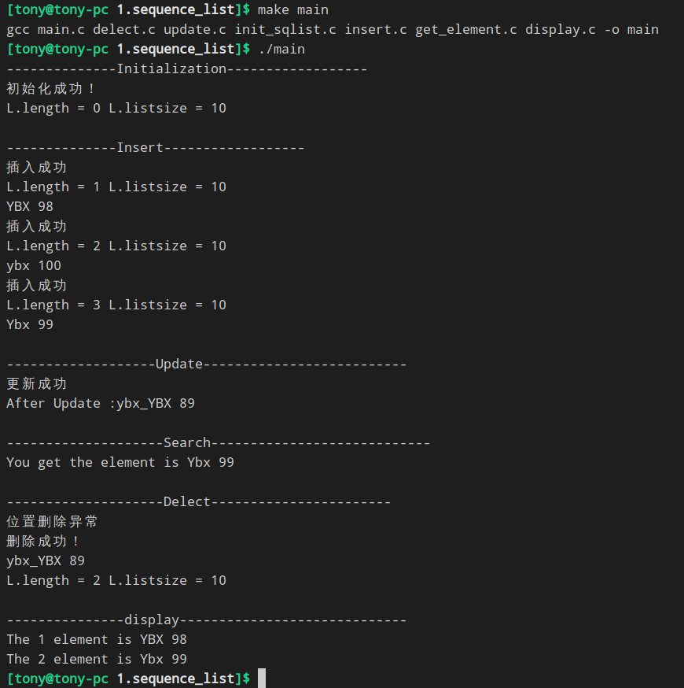

# 顺序存储
本片文章是计算1702班杨秉学整理
本文件夹你将看到如下文件
- [定义静态顺序表](static_sequence.h) <br>[定义动态顺序表](dynamic_sequence.h)
- [初始化](init_sqlist.c)
- [插入](insert.c)
- [更新](update.c)
- [给定位置查询](get_element.c)
- [删除](delect.c)
- [遍历](display.c)
- [主函数](main.c)
- [升级版主函数](main_update.c)

### 运行
执行```make main ```你将看到
