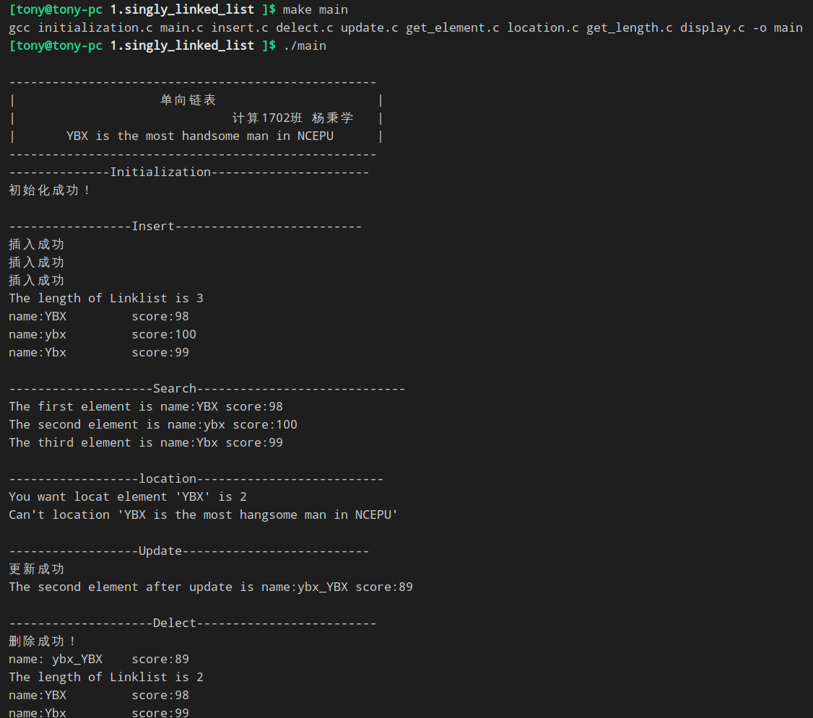

# 单链表
本片文章是计算1702班杨秉学整理
本文件夹你将看到如下文件
- [定义表](singly_linked.h)
- [初始化](initialization.c)
- [插入](insert.c)
- [定位](location.c)
- [更新](update.c)
- [给定位置查询](get_element.c)
- [得到链表长度](get_length.c)
- [删除元素](delect.c)
- [遍历链表](display.c)
- [主函数](main.c)

### 运行
执行```make main ```你将看到