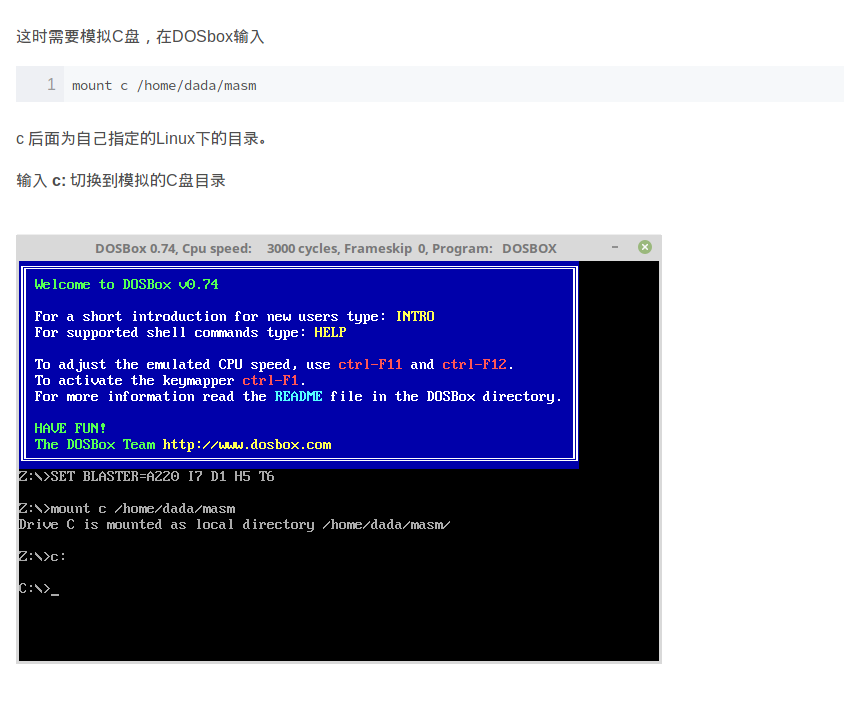

### [环境搭建](https://blog.csdn.net/YuzuruHanyu/article/details/80287419)
- [dosbox](https://pan.baidu.com/s/1gXPKTT-xKb6BpjOJdhmudA) 密码：khqs
- [masm](https://pan.baidu.com/s/177arSA34plWqV-iyffWpEw) 密码：3akd
 > masm文件夹内至少要包含这4个文件：masm.exe, link.exe, debug.exe, exe2bin.exe。

### 使用

