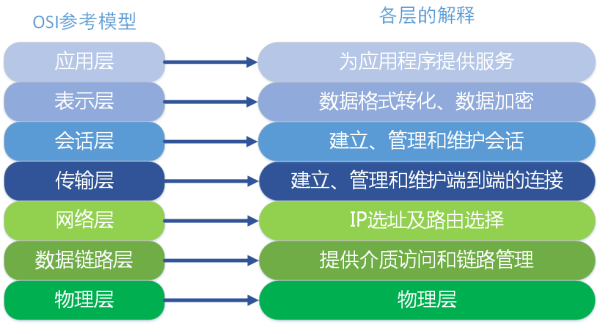

## P29,2.协议、接口与服务有和区别？有和联系？
##### 网络协议与服务的区别如下：
- 1、定义上的区别：
> 网络协议为计算机网络中进行数据交换而建立的规则、标准或约定的集合。协议是规则，约定，而服务是功能，本领。

- 2、层次上的区别：
> 网络协议是由于网络节点之间联系的复杂性，在制定协议时，通常把复杂成分分解成一些简单成分，然后再将它们复合起来。协议是通信双方对等层之间才有的，是水平方向上的关系。而服务则是通信某一端上下层之间才有的，是垂直方向上的关系，而且是自下向上提供的。

- 3、水平与垂直的区别：
> 协议是“水平的”，即协议是控制两个对等实体进行通信的规则。但服务是“垂直的”，即服务是由下层通过层间接口向上层提供的。上层使用所提供的服务必须与下层交换一些命令，这些命令在OSI中称为服务原语。

##### 网络协议与服务的关系：
在协议的控制下，两个对等实体间的通信使得本层能够向上一层提供服务，而要实现本层协议，还需要使用下面一层提供服务。

## P29,3.网络协议的三个要素是什么？各有什么含义？
网络协议：为进行网络中的数据交换而建立的规则、标准或约定。由以下三个要素组成：
- （1）语法：即数据与控制信息的结构或格式。
- （2）语义：即需要发出何种控制信息，完成何种动作以及做出何种响应。
- （3）同步：即事件实现顺序的详细说明。协议是控制两个对等实体进行通信的规则的集合。

## P29,4.OSI参考模型的层次划分原则是什么？画出OSI参考模型结构示意图，并简述各层的主要功能。
##### OSI参考模型的层次划分原则
- （1）网路中各节点都有相同的层次；
- （2）不同节点的同等层具有相同的功能；
- （3）同一节点内相邻层之间通过接口通信；
- （4）每一层使用下层提供的服务，并向其上层提供服务；
- （5）不同节点的同等层按照协议实现对等层之间的通信。
- （6）根据功能需要进行分层，每层应当实现定义明确的功能。
- （7）向应用程序提供服务

## P29,6.为了使协议数据单元(PDU)能够被正确传送到目的地的对等层，每层协议附加的报头中通常包含一些什么样的信息？
为了能正确的将协议数据单元传送到目的端，在报头中必须包含该层虚通信源端和目的端信息。例如，IP分组中包含源IP地址和目的IP地址，在以太网数据帧中的源MAC地址和目的MAC地址等。其次，必须包含一些和相邻层有关的说明信息，以说明本层的服务和相邻层的服务。再者，还需要一些对于本身数据的描述和校验，例如指出该协议数据单元的性质和格式，长度信息，校验码等。

## P29,8.试比较OSI与TCP/IP体系结构的异同点。
##### 共同点
- 1、它们都是网络通信模型。
- 2、它们都有网络层、传输层和应用层。
- 3、它们都有统一的网络地址分配方案，使得整个TCP/IP设备在网中都具有惟一的地址，

##### 不同点
1、网络模型层数不同
- （1）OSI参考模型分为7层。
- （2）TCP/IP体系结构分为4层。

2、支持连接不同
- （1）OSI参考模型同时支持无连接和面向连接的通信，但在传输层上只支持面向连接的通信。
- （2）TCP/IP体系结构的网络层只支持无连接的服务，但在传输层上同时支持无连接和面向连接的通信。

## P29,10.试解释一下名词：协议栈、实体、层、协议数据单元、服务访问点。
协议栈：由于计算机网络的体系结构采用了分层结构，这些一层层的协议画起来很像堆栈的结构。

实体：表示任何可发送或接收信息的硬件或软件进程。

对等层：在网络体系结构中,通信双方实现同样功能的层。

协议数据单元：通常记为PDU，对等层实体进行信息交换的数据单位。

服务访问点：通常记为SAP，在同一系统中相邻两层的实体进行交互(即交换信息)的地方，它是一个抽象的概念，它实体上就是一个逻辑接口。

## P29,12.假设一个系统具有n层协议，其中应用进程生成长度为m字节的数据。从第2层到第n层，每层都增加上长度为h字节的报头，计算为传输报头所占用的网络带宽百分比。
在同一结点内,当应用进程产生数据从最高层传至最低层时,所添加的报头的总长 度为nh字节,数据部分仍为m字节。因此,为传输报头所占用的网络带宽百分比为:
$$\frac{nh}{nh+m}\times{100\%}  $$
