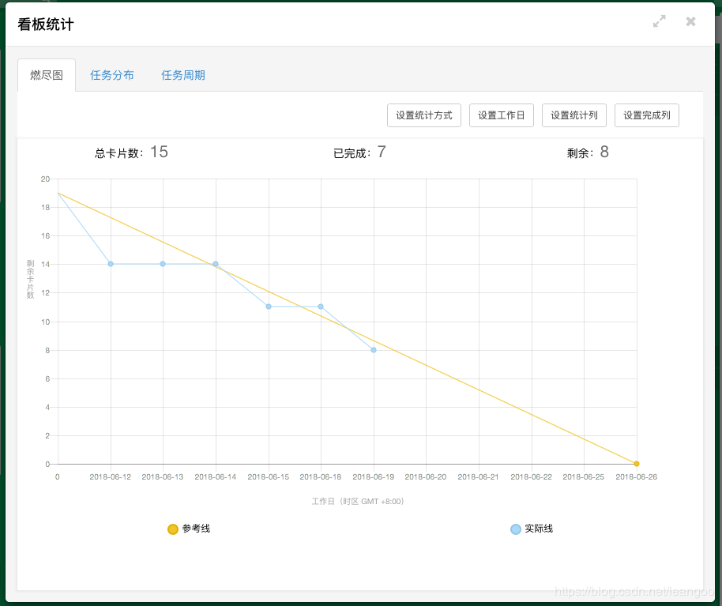

# 第3次作业
### 一、软件生存期模型有那些？各有什么特点？
##### 1.瀑布模型
- 阶段间具有顺序性和依赖性。
- 推迟实现的观点
- 质量保证的观点

##### 2.快速增量模型
快速原型是快速建立起来的可以在计算机上运行的程序，它所能完成的功能往往是最终产品能完成的功能的一个子集。

##### 3.增量模型（渐增模型）
把软件产品作为一系列的增量构件来设计、编码、集成和测试。每个构件由多个相互作用的模块构成，并且能够完成特定的功能。

##### 4.螺旋模型
将瀑布模型与快速原型模型结合起来，并且**加入**两种模型均忽略了的**风险分析**。
使用原型及其他方法来尽量降低风险

##### 5.喷泉模型
是典型的面向对象生命周期模型。**迭代**和**无间隙特性**。

##### 6.统一模型
用例驱动、以**架构**为中心迭代增量式地开发软件。

##### 7.基于构建的开发模型
强调使用**可复用**的软件“构件”来设计和构造基于计算机的系统的过程。

考虑的焦点是 **“集成”**，而不再是 **“实现”**。

##### 8.敏捷过程
- 最优先要做的是通过尽早、持续交付有价值的软件来使客户满意。
- 即使在开发的后期，也欢迎需求变更。
- 经常交付可运行软件，交付的间隔可以从几个星期到几个月，交付的时间间隔越短越好。


### 二、调研敏捷开发方法，主要是Scrum模型。
Srum 的目标：```Deliver the highest business value in the shorttest time```
核心——**迭代**


#### 1.产品订单
由Product Owner 负责按**优先顺序**排列的一个产品需求列表.

Scrum Team根据Product Backlog列表，做工作量的预估和安排；

#### 2.迭代订单
把一个复杂且开发周期很长的开发任务，分解为很多小周期可完成的任务，这样的一个周期就是一次迭代的过程；同时每一次迭代都可以生产或开发出一个可以交付的软件产品。

#### 3.每日例会


#### 4.任务看版
展现了我们在Sprint过程中所有要完成的任务。在Sprint过程中我们要不断的更新它。–如果某个开发人员想到了一个任务他就可以把这个任务写下来放在任务墙上。


#### 5.燃尽图
燃尽图是在项目完成之前，对需要完成的工作任务的一种可视化表示。它能形象地展示当前迭代中的剩余工作量和剩余工作时间的变化趋势，是反应项目进展的一个指示器。

燃尽图有一个Y轴（剩余工作量）和X轴（时间）。理想情况下，它应该是一个向下的曲线，随着日期的推进和剩余工作的完成而“烧尽”至零。   但是现实情况下，因为各种原因燃尽图往往会出现低谷或者高峰。


##### 燃尽图规则：
- （1）如果实际线在“参考线”下方，说明进展顺利
- （2）如果实际线在“参考线”上方，说明任务延期

#### 6.软件工具
Shell:Bash
版本维护：git
编辑器：vim、VScode
开发工具：GCC、GDB、make
硬件模拟器：qemu、Bochs

#### 7.制定本项目组的开发计划
