##### 由于本项目体积很大，故推荐采用在 **GitHub Web 端直接上传** 的方式，具体操作如下： 
1.首先 Fork 本项目 
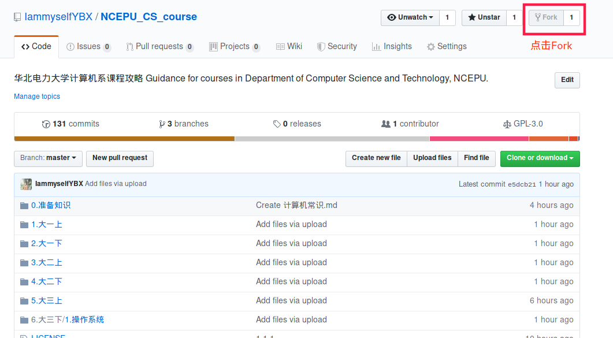 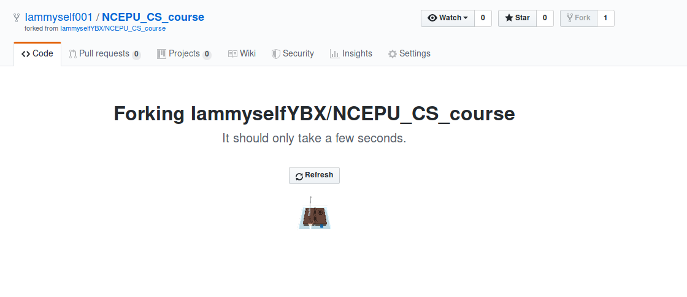 
2.upload 
- 上传文件到已有文件夹：打开对应文件夹，点击绿色 Download 按钮旁的 upload，上传你的文件。 
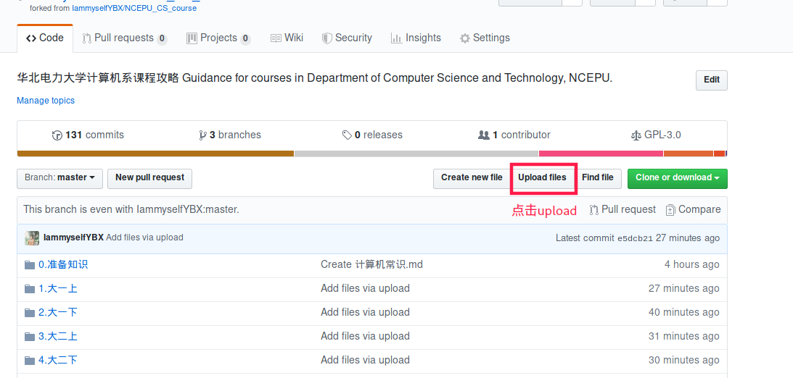
- 上传文件到新文件夹：打开任意文件夹，点击绿色 Download 按钮旁的 upload，**把浏览器地址栏中文件夹名称改为你想要新建的文件夹名称，然后回车**，上传你的文件。 
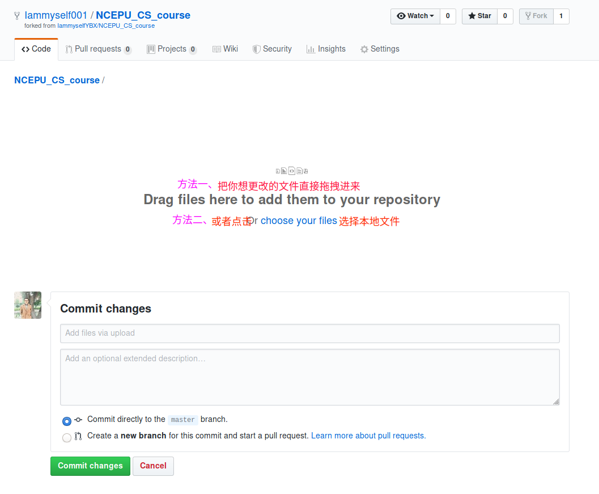
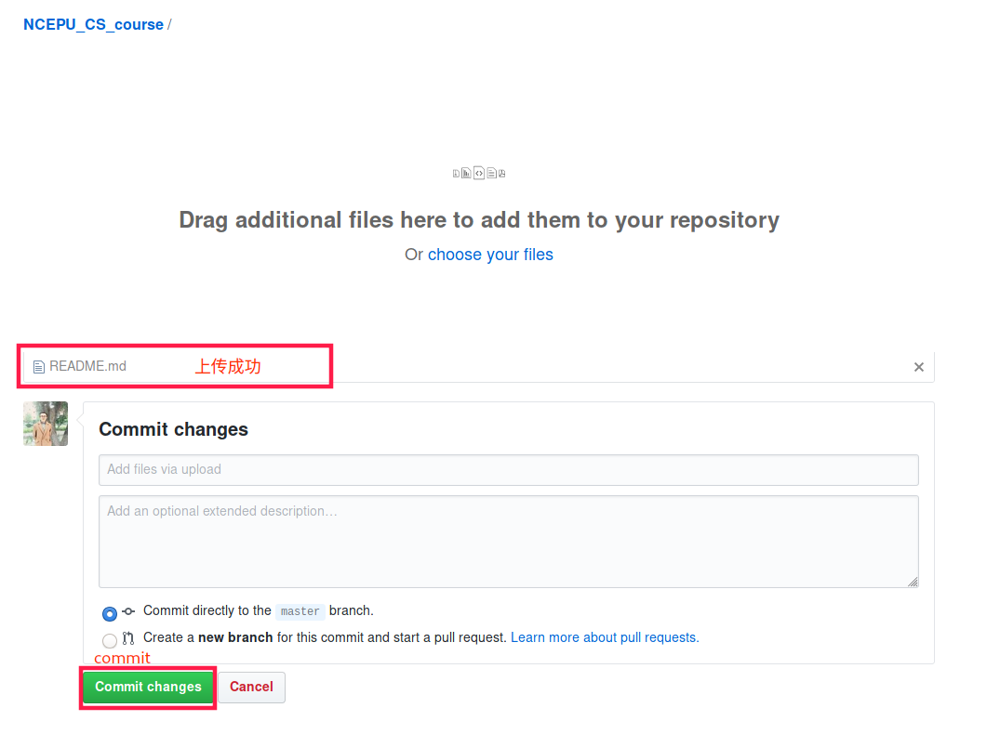
3.发起PR 
- 提交 PR：Fork 本项目，然后在 GitHub 网页端点击 Upload File 上传文件，发起 PR 即可。留意一下项目的文件组织喔。
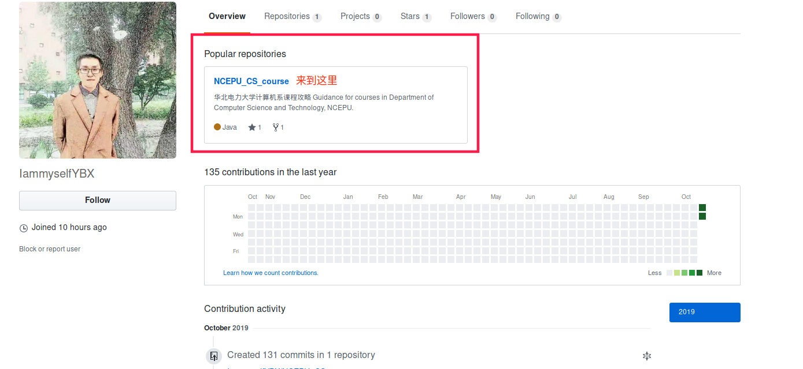
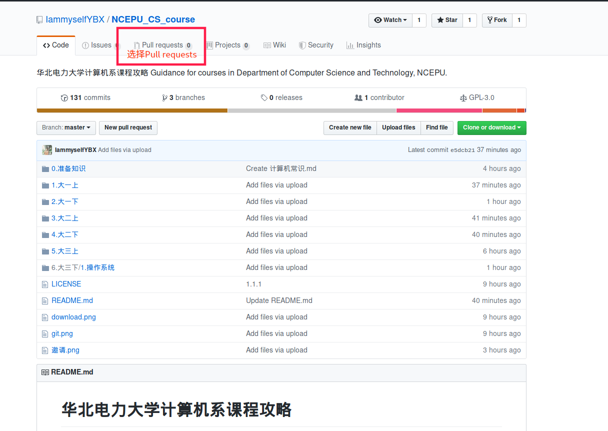
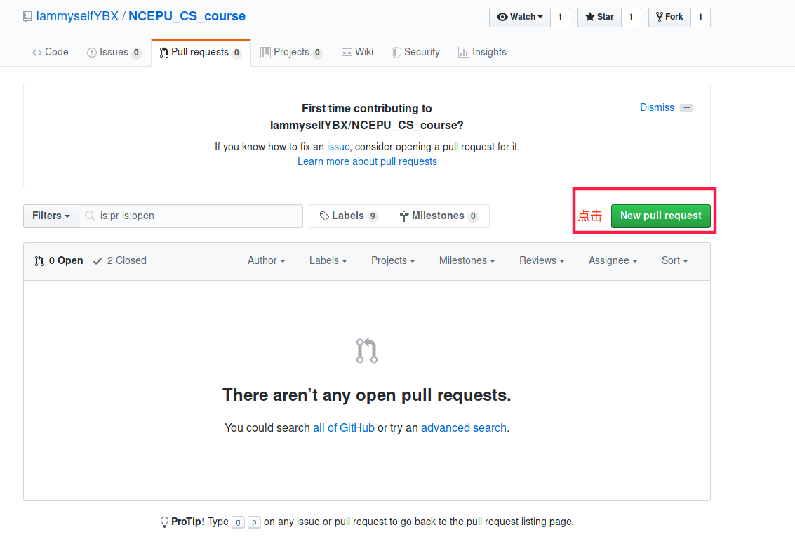
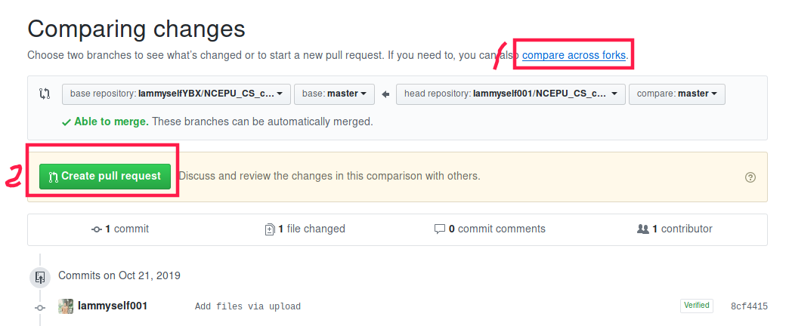
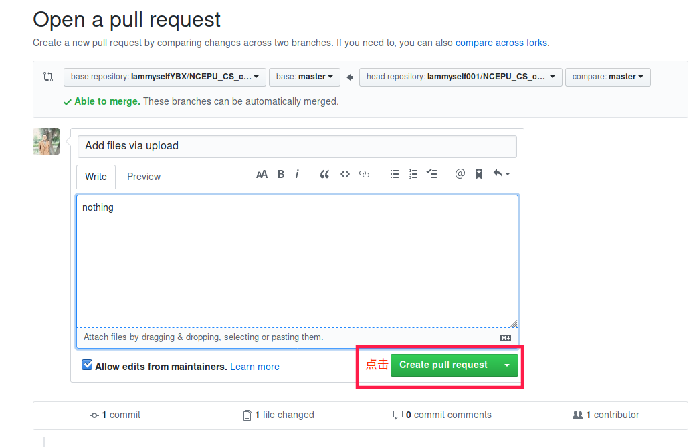
- 或者也可以直接附加在 Issue 中，由维护者进行添加。
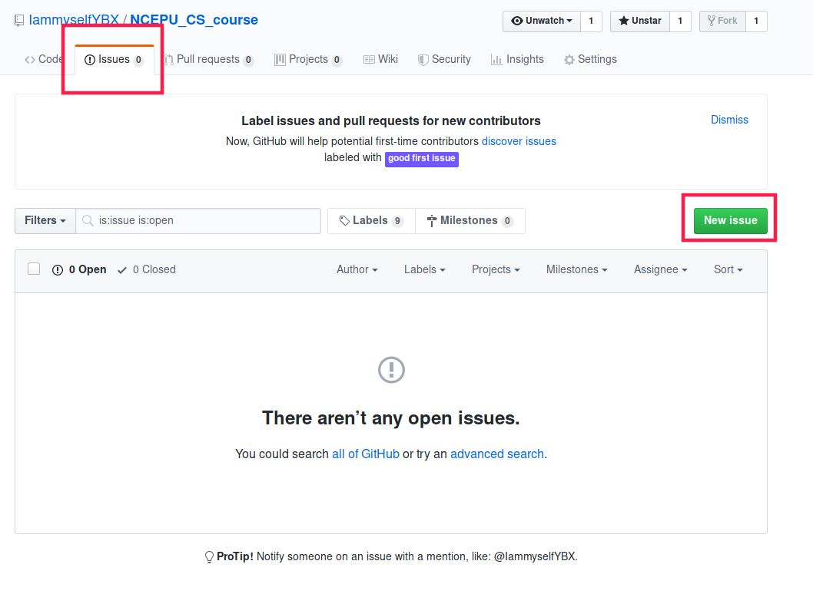
