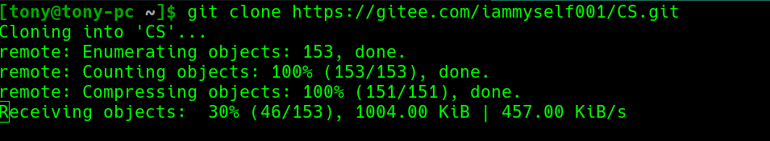

#  华北电力大学计算机系课程攻略

## 介绍
&emsp;&emsp;受[清华大学](https://github.com/PKUanonym/REKCARC-TSC-UHT)，[北京大学](https://lib-pku.github.io/)，[浙江大学](https://github.com/QSCTech/zju-icicles)，[北京邮电大学](https://github.com/ningzimu/See_you_in_BUPT)的启发，创立了本项目。


---
## 前言
&emsp;&emsp;还记得刚来大学的时候，上过很多课，考过很多试，也查找过很多资料，花费了不少精力，我为这一年一年，这么多人孤军奋战的重复劳动感到不平。<br>
&emsp;&emsp;我也曾很努力地收集各种课程资料，但到最后，某些重要信息的得到却往往依然是纯属偶然。这种状态时常令我感到后怕与不安。我也曾在课程结束后终于有了些许方法与总结，但这些想法无处诉说，也不知道给怎么述说，最终只能把花费时间与精力才换来的经验耗散在了漫漫的遗忘之中。<br>
&emsp;&emsp;大一刚来的时候经常思考的一个问题————怎么可以学的好，但是问学长，老师的答案仅仅就是好好上课，多读书，认真记笔记学习就好了，但是这样的回答很范，不具体。所以，借此机会成立一个平台。  


---
## 期望
&emsp;&emsp;我希望能够将这些隐晦的、不确定的、口口相传的资料和经验，变为公开的、易于获取的和大家能够共同完善、积累的共享资料。
&emsp;&emsp;我希望只要是前人走过的弯路，后人就不必再走。这是我的信念，也是我建立这个项目的原因。<br>

---
## 使用
#### 一、使用git
```
git clone https://gitee.com/iammyself001/CS.git
```
<br>


#### 二、直接下载
<br>


---
## 平台
#### 一、为什么不是github而是码云？
&emsp;&emsp;首先在国内访问国外网站速度很慢，考虑到这个项目有可能会发展的很大，下载起来会很不方便就放到国内的码云。
#### 二、平台上传什么资料
- 选课攻略
- 电子版教材
- 平时作业答案
- 历年试卷
- 复习资料
- 开卷考试 A4 纸
#### 三、警告
下列内容为不适合上传的内容。如果你认为缺少这些资料将会影响资源的完整性，请优先考虑放在校内资源平台，或联系你的教师并由教师发布。建议你撰写一个 README 文档并放置一些链接或指引文字来帮助找到这些资源。
- 盗版电子书/付费电子书
- 盗版/破解版/绿色版付费软件及其安装包
- 课程/教师主页上列出的内容（请在获得教师许可后上传）


---
## 贡献
**欢迎贡献！**
**欢迎贡献！**
**欢迎贡献！**
*——因为很重要所以说了三遍*(所以西游记里面白骨精最重要:kissing_heart::kissing_heart::kissing_heart:)
Issue、PR、纠错、资料、选课/考试攻略，完全欢迎！
来自大家的关注、维护和贡献，才是让这个华北电力大学独有的攻略本继续存在的动力~


---
## 最后
&emsp;&emsp;如果你认为本仓库的一些文件侵犯了您的权益，请联系我[QQ邮箱](mailto:2252176220@qq.com) 。我将会从仓库中彻底清除这些文件。
> 资料仅供参考，请自己判断其适用性。
其他部分的版权归属于其各自的作者。
