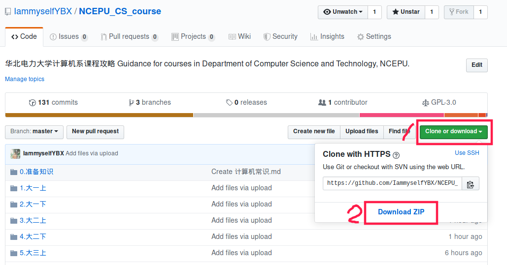
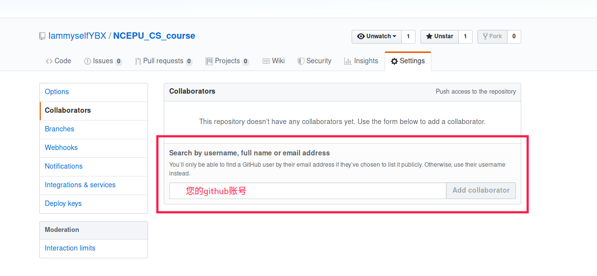
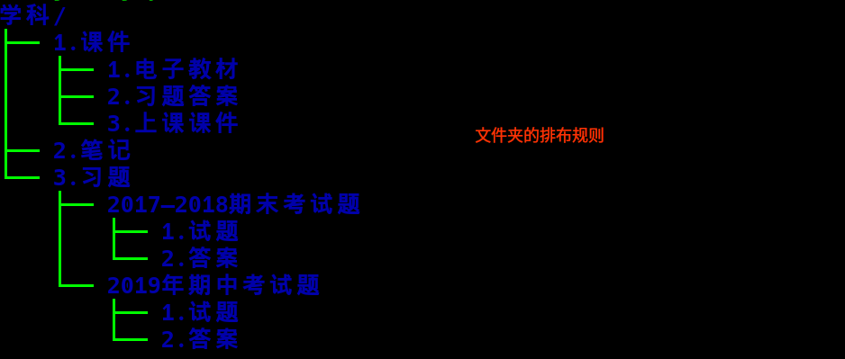

#  华北电力大学计算机系课程攻略
[](https://github.com/IammyselfYBX/NCEPU_CS_course/watchers)
[](https://github.com/IammyselfYBX/NCEPU_CS_course/stargazers)
[](https://github.com/IammyselfYBX/NCEPU_CS_course/network/members)

[](https://github.com/IammyselfYBX/NCEPU_CS_course/graphs/contributors)

## 介绍
&emsp;&emsp;受[清华大学](https://github.com/PKUanonym/REKCARC-TSC-UHT)，[北京大学](https://lib-pku.github.io/)，[北京大学课程资料整理](https://github.com/lib-pku/libpku)，[北大计算机课程大作业](https://github.com/tongtzeho/PKUCourse)，[浙江大学](https://github.com/QSCTech/zju-icicles)，[东南大学课程共享计划](https://github.com/zjdx1998/seucourseshare)，[北京邮电大学](https://github.com/ningzimu/See_you_in_BUPT)，[上海交通大学课程资料分享](https://github.com/CoolPhilChen/SJTU-Courses/)的启发，创立了本项目。

---
## 前言
&emsp;&emsp;还记得刚来大学的时候，上过很多课，考过很多试，也查找过很多资料，花费了不少精力，我想之前肯定也会有很多人有像我一样的想法，真为这一年一年，这么多人孤军奋战的重复劳动感到不平。<br>
&emsp;&emsp;我也曾很努力地收集各种课程资料，但到最后，某些重要信息的得到却往往依然是纯属偶然。这种状态时常令我感到后怕与不安。我也曾在课程结束后终于有了些许方法与总结，但这些想法无处诉说，也不知道给怎么述说，最终只能把花费时间与精力才换来的经验耗散在了漫漫的遗忘之中。<br>
&emsp;&emsp;大一刚来的时候经常思考的一个问题————怎么可以学的好，但是问学长，老师的答案仅仅就是好好上课，多读书，认真记笔记学习就好了，但是这样的回答很范，不具体。所以，借此机会成立一个平台。  
##### <i>截止到目前为止2019年10月，学校网站依旧没有提供2017版教学大纲，需要查看的到教二查看纸质版材料</i>

---
## 期望
&emsp;&emsp;我希望能够将这些隐晦的、不确定的、口口相传的资料和经验，变为公开的、易于获取的和大家能够共同完善、积累的共享资料。<br>
&emsp;&emsp;我希望只要是前人走过的弯路，后人就不必再走。这是我的信念，也是我建立这个项目的原因。<br>

---
## 目录
#### 准备知识
- [进入大学前准备](https://github.com/IammyselfYBX/NCEPU_CS_course/blob/master/0.%E5%87%86%E5%A4%87%E7%9F%A5%E8%AF%86/%E8%BF%9B%E5%85%A5%E5%A4%A7%E5%AD%A6%E5%89%8D%E5%87%86%E5%A4%87.md)
- [学习指南](https://github.com/IammyselfYBX/NCEPU_CS_course/blob/master/0.%E5%87%86%E5%A4%87%E7%9F%A5%E8%AF%86/%E5%8D%8E%E5%8C%97%E7%94%B5%E5%8A%9B%E5%A4%A7%E5%AD%A6%E5%AD%A6%E4%B9%A0%E6%8C%87%E5%8D%97.md)
- [生活指南](https://github.com/IammyselfYBX/NCEPU_CS_course/blob/master/0.%E5%87%86%E5%A4%87%E7%9F%A5%E8%AF%86/%E5%8D%8E%E5%8C%97%E7%94%B5%E5%8A%9B%E5%A4%A7%E5%AD%A6%E7%94%9F%E6%B4%BB%E6%8C%87%E5%8D%97.md)
- [资料搜索与获取](https://github.com/IammyselfYBX/NCEPU_CS_course/blob/master/0.%E5%87%86%E5%A4%87%E7%9F%A5%E8%AF%86/%E8%B5%84%E6%96%99%E6%90%9C%E7%B4%A2%E4%B8%8E%E8%8E%B7%E5%8F%96.md)
- [技能学习](https://github.com/IammyselfYBX/NCEPU_CS_course/blob/master/0.%E5%87%86%E5%A4%87%E7%9F%A5%E8%AF%86/%E6%8A%80%E8%83%BD%E5%AD%A6%E4%B9%A0.md)
- [在线工具](https://github.com/IammyselfYBX/NCEPU_CS_course/blob/master/0.%E5%87%86%E5%A4%87%E7%9F%A5%E8%AF%86/%E5%9C%A8%E7%BA%BF%E5%B7%A5%E5%85%B7.md)
- [华北电力大学普通本科学生学籍管理预警制度暂行办法（2017年修订）](https://github.com/IammyselfYBX/NCEPU_CS_course/blob/master/0.%E5%87%86%E5%A4%87%E7%9F%A5%E8%AF%86/%E5%8D%8E%E5%8C%97%E7%94%B5%E5%8A%9B%E5%A4%A7%E5%AD%A6%E6%99%AE%E9%80%9A%E6%9C%AC%E7%A7%91%E5%AD%A6%E7%94%9F%E5%AD%A6%E7%B1%8D%E7%AE%A1%E7%90%86%E9%A2%84%E8%AD%A6%E5%88%B6%E5%BA%A6%E6%9A%82%E8%A1%8C%E5%8A%9E%E6%B3%95%EF%BC%882017%E5%B9%B4%E4%BF%AE%E8%AE%A2%EF%BC%89%20.doc)
- [华北电力大学本科学生辅修专业、学位](https://github.com/IammyselfYBX/NCEPU_CS_course/blob/master/0.%E5%87%86%E5%A4%87%E7%9F%A5%E8%AF%86/%E5%8D%8E%E5%8C%97%E7%94%B5%E5%8A%9B%E5%A4%A7%E5%AD%A6%E6%9C%AC%E7%A7%91%E5%AD%A6%E7%94%9F%E8%BE%85%E4%BF%AE%E4%B8%93%E4%B8%9A%E3%80%81%E5%AD%A6%E4%BD%8D%20.doc)
- [教学一览2013](https://github.com/IammyselfYBX/NCEPU_CS_course/blob/master/0.%E5%87%86%E5%A4%87%E7%9F%A5%E8%AF%86/%E6%95%99%E5%AD%A6%E4%B8%80%E8%A7%882013.doc)
- [计算机专业必修课](https://github.com/IammyselfYBX/NCEPU_CS_course/blob/master/0.%E5%87%86%E5%A4%87%E7%9F%A5%E8%AF%86/%E8%AE%A1%E7%AE%97%E6%9C%BA%E4%B8%93%E4%B8%9A%E5%BF%85%E4%BF%AE%E8%AF%BE.docx)

#### 先修课
- [高等数学(上)](https://github.com/IammyselfYBX/NCEPU_CS_course/tree/master/1.%E5%A4%A7%E4%B8%80%E4%B8%8A/1.%E9%AB%98%E7%AD%89%E6%95%B0%E5%AD%A6)
- [高等数学(下)]()
- [线性代数](https://github.com/IammyselfYBX/NCEPU_CS_course/tree/master/3.%E5%A4%A7%E4%BA%8C%E4%B8%8A/3.%E7%BA%BF%E6%80%A7%E4%BB%A3%E6%95%B0)
- [概率论数理统计](https://github.com/IammyselfYBX/NCEPU_CS_course/tree/master/4.%E5%A4%A7%E4%BA%8C%E4%B8%8B/3.%E6%A6%82%E7%8E%87%E8%AE%BA%E4%B8%8E%E6%A2%B3%E7%90%86%E7%BB%9F%E8%AE%A1)
- [电路理论B(上)](https://github.com/IammyselfYBX/NCEPU_CS_course/tree/master/3.%E5%A4%A7%E4%BA%8C%E4%B8%8A/5.2018-2019%E7%94%B5%E8%B7%AF%E7%90%86%E8%AE%BAB)
- [电路理论B(下)](https://github.com/IammyselfYBX/NCEPU_CS_course/tree/master/4.%E5%A4%A7%E4%BA%8C%E4%B8%8B/5.%E7%94%B5%E8%B7%AF%E7%90%86%E8%AE%BAB)
- [模拟电子技术基础](https://github.com/IammyselfYBX/NCEPU_CS_course/tree/master/4.%E5%A4%A7%E4%BA%8C%E4%B8%8B/2.%E6%A8%A1%E6%8B%9F%E7%94%B5%E5%AD%90%E6%8A%80%E6%9C%AF%E5%9F%BA%E7%A1%80)
- [数字逻辑](https://github.com/IammyselfYBX/NCEPU_CS_course/tree/master/5.%E5%A4%A7%E4%B8%89%E4%B8%8A/4.%E6%95%B0%E5%AD%97%E9%80%BB%E8%BE%91)
- [马克思原理](https://github.com/IammyselfYBX/NCEPU_CS_course/tree/master/1.%E5%A4%A7%E4%B8%80%E4%B8%8A/4.%E9%A9%AC%E5%85%8B%E6%80%9D%E5%8E%9F%E7%90%86)
- [思想道德修养与法律基础](https://github.com/IammyselfYBX/NCEPU_CS_course/tree/master/1.%E5%A4%A7%E4%B8%80%E4%B8%8A/3.%E6%80%9D%E6%83%B3%E9%81%93%E5%BE%B7%E4%BF%AE%E5%85%BB%E4%B8%8E%E6%B3%95%E5%BE%8B%E5%9F%BA%E7%A1%80)
- [近代史纲要](https://github.com/IammyselfYBX/NCEPU_CS_course/tree/master/2.%E5%A4%A7%E4%B8%80%E4%B8%8B/2.%E8%BF%91%E4%BB%A3%E5%8F%B2%E7%BA%B2%E8%A6%81)
- [毛泽东思想和中国特色社会主义理论体系概论](https://github.com/IammyselfYBX/NCEPU_CS_course/blob/master/3.%E5%A4%A7%E4%BA%8C%E4%B8%8A/2.%E6%AF%9B%E6%B3%BD%E4%B8%9C%E6%80%9D%E6%83%B3%E5%92%8C%E4%B8%AD%E5%9B%BD%E7%89%B9%E8%89%B2%E7%A4%BE%E4%BC%9A%E4%B8%BB%E4%B9%89%E7%90%86%E8%AE%BA%E4%BD%93%E7%B3%BB%E6%A6%82%E8%AE%BA/README.md)

#### 计算机专业课
###### 专业基础课
- [计算机相关视频](https://github.com/IammyselfYBX/NCEPU_CS_course/blob/master/0.%E5%87%86%E5%A4%87%E7%9F%A5%E8%AF%86/%E8%AE%A1%E7%AE%97%E6%9C%BA%E7%9B%B8%E5%85%B3%E8%A7%86%E9%A2%91.md)
- [计算机常识](https://github.com/IammyselfYBX/NCEPU_CS_course/blob/master/0.%E5%87%86%E5%A4%87%E7%9F%A5%E8%AF%86/%E8%AE%A1%E7%AE%97%E6%9C%BA%E5%B8%B8%E8%AF%86.md)
- [计算机导论](https://github.com/IammyselfYBX/NCEPU_CS_course/tree/master/1.%E5%A4%A7%E4%B8%80%E4%B8%8A/5.%E8%AE%A1%E7%AE%97%E6%9C%BA%E5%AF%BC%E8%AE%BA)
- [C语言](https://github.com/IammyselfYBX/NCEPU_CS_course/tree/master/1.%E5%A4%A7%E4%B8%80%E4%B8%8A/2.C%E8%AF%AD%E8%A8%80)
- [离散数学](https://github.com/IammyselfYBX/NCEPU_CS_course/tree/master/2.%E5%A4%A7%E4%B8%80%E4%B8%8B/3.%E7%A6%BB%E6%95%A3%E6%95%B0%E5%AD%A6)
- [数据结构与算法(上)](https://github.com/IammyselfYBX/NCEPU_CS_course/tree/master/2.%E5%A4%A7%E4%B8%80%E4%B8%8B/1.%E6%95%B0%E6%8D%AE%E7%BB%93%E6%9E%84%E4%B8%8E%E7%AE%97%E6%B3%95)
- [数据结构与算法(下)](https://github.com/IammyselfYBX/NCEPU_CS_course/tree/master/3.%E5%A4%A7%E4%BA%8C%E4%B8%8A/1.%E6%95%B0%E6%8D%AE%E7%BB%93%E6%9E%84%E4%B8%8E%E7%AE%97%E6%B3%95)


###### 计算机科学与技术
- [基于80x86汇编语言](https://github.com/IammyselfYBX/NCEPU_CS_course/tree/master/4.%E5%A4%A7%E4%BA%8C%E4%B8%8B/1.80x86%E6%B1%87%E7%BC%96)
- [微机原理与接口技术](https://github.com/IammyselfYBX/NCEPU_CS_course/tree/master/5.%E5%A4%A7%E4%B8%89%E4%B8%8A/1.%E5%BE%AE%E6%9C%BA%E5%8E%9F%E7%90%86%E4%B8%8E%E6%8E%A5%E5%8F%A3%E6%8A%80%E6%9C%AF(%E7%AC%AC4%E7%89%88))
- [编译原理](https://github.com/IammyselfYBX/NCEPU_CS_course/tree/master/5.%E5%A4%A7%E4%B8%89%E4%B8%8A/2.%E7%BC%96%E8%AF%91%E5%8E%9F%E7%90%86)
- [计算机组成原理](https://github.com/IammyselfYBX/NCEPU_CS_course/tree/master/5.%E5%A4%A7%E4%B8%89%E4%B8%8A/3.%E8%AE%A1%E7%AE%97%E6%9C%BA%E7%BB%84%E6%88%90%E5%8E%9F%E7%90%86)
- [数据库](https://github.com/IammyselfYBX/NCEPU_CS_course/tree/master/5.%E5%A4%A7%E4%B8%89%E4%B8%8A/5.%E6%95%B0%E6%8D%AE%E5%BA%93)
 - [操作系统](https://github.com/IammyselfYBX/NCEPU_CS_course/tree/master/6.%E5%A4%A7%E4%B8%89%E4%B8%8B/1.%E6%93%8D%E4%BD%9C%E7%B3%BB%E7%BB%9F)
 - [Linux体系及编程](https://github.com/IammyselfYBX/NCEPU_CS_course/tree/master/7.%E5%A4%A7%E5%9B%9B%E4%B8%8A/1.Linux%E4%BD%93%E7%B3%BB%E5%8F%8A%E7%BC%96%E7%A8%8B)


###### 软件工程
- [Java语言程序设计](https://github.com/IammyselfYBX/NCEPU_CS_course/tree/master/3.%E5%A4%A7%E4%BA%8C%E4%B8%8A/4.java%E6%95%99%E6%9D%90%E9%85%8D%E5%A5%97%E8%AF%BE%E4%BB%B6)
- [C++语言程序设计](https://github.com/IammyselfYBX/NCEPU_CS_course/tree/master/3.%E5%A4%A7%E4%BA%8C%E4%B8%8A/6.C%2B%2B%E9%AB%98%E7%BA%A7%E8%AF%AD%E8%A8%80%E7%A8%8B%E5%BA%8F%E8%AE%BE%E8%AE%A1)

###### 信息安全
- [信息论与编码](https://github.com/IammyselfYBX/NCEPU_CS_course/tree/master/4.%E5%A4%A7%E4%BA%8C%E4%B8%8B/4.%E4%BF%A1%E6%81%AF%E8%AE%BA%E4%B8%8E%E7%BC%96%E7%A0%81)

###### 物联网

#### 校选课
- [电子文件检索与利用](https://github.com/IammyselfYBX/NCEPU_CS_course/tree/master/4.%E5%A4%A7%E4%BA%8C%E4%B8%8B/%E6%A0%A1%E9%80%89%E8%AF%BE1.%E7%94%B5%E5%AD%90%E6%96%87%E4%BB%B6%E6%A3%80%E7%B4%A2%E4%B8%8E%E5%88%A9%E7%94%A8)
- [相约图书馆](https://github.com/IammyselfYBX/NCEPU_CS_course/tree/master/4.%E5%A4%A7%E4%BA%8C%E4%B8%8B/%E6%A0%A1%E9%80%89%E8%AF%BE2.%E7%9B%B8%E7%BA%A6%E5%9B%BE%E4%B9%A6%E9%A6%86)
- [创新经济学](https://github.com/IammyselfYBX/NCEPU_CS_course/tree/master/5.%E5%A4%A7%E4%B8%89%E4%B8%8A/%E6%A0%A1%E9%80%89%E8%AF%BE1.%E5%88%9B%E6%96%B0%E7%BB%8F%E6%B5%8E%E5%AD%A6)

#### 专业选修课
- [软件人机界面设计](https://github.com/IammyselfYBX/NCEPU_CS_course/tree/master/4.%E5%A4%A7%E4%BA%8C%E4%B8%8B/%E4%B8%93%E9%80%89%E8%AF%BE2.%E8%BD%AF%E4%BB%B6%E4%BA%BA%E6%9C%BA%E7%95%8C%E9%9D%A2%E8%AE%BE%E8%AE%A1)
- [计算机图形学](https://github.com/IammyselfYBX/NCEPU_CS_course/tree/master/4.%E5%A4%A7%E4%BA%8C%E4%B8%8B/%E4%B8%93%E9%80%89%E8%AF%BE1.CG_progressing)
- [Web开发](https://github.com/IammyselfYBX/NCEPU_CS_course/tree/master/4.%E5%A4%A7%E4%BA%8C%E4%B8%8B/%E4%B8%93%E9%80%89%E8%AF%BE3.Web%E5%BC%80%E5%8F%91)

---
## 下载方式
#### 一、使用git
```
git clone https://github.com/IammyselfYBX/NCEPU_CS_course.git
```


#### 二、直接下载


---
## 平台
#### 一、为什么是github而不是另搭建一个服务器？
&emsp;&emsp;首先，学校之前的消息比较零散，没有一个统一平台来管理。<br>
&emsp;&emsp;其次，每个计算机专业的学生都可以熟练地使用git来管理相对大规模的项目，所以借此机会将学校的零散资源采用版本控制的方式整合，也可以温习一下课程 \\(≧▽≦)/。<br>
&emsp;&emsp;最后，也是比较关键的就是并不是所有大学生都可以获得奖学金，没办法免费维持一个服务器长期正常工作
#### 二、平台上传什么资料
- 选课攻略
- 电子版教材
- 平时作业答案
- 历年试卷
- 复习资料
- 开卷考试 A4 纸
#### 三、警告
下列内容为不适合上传的内容。如果你认为缺少这些资料将会影响资源的完整性，请优先考虑放在校内资源平台，或联系你的教师并由教师发布。建议你撰写一个 README 文档并放置一些链接或指引文字来帮助找到这些资源。
- 盗版电子书/付费电子书
- 盗版/破解版/绿色版付费软件及其安装包
- 课程/教师主页上列出的内容（请在获得教师许可后上传）


---
## 贡献
**欢迎贡献！** <br>
**欢迎贡献！** <br>
**欢迎贡献！** <br>
&emsp;&emsp;*——因为很重要所以说了三遍*(所以西游记里面白骨精最重要 (•‾̑⌣‾̑•)✧ )<br>
[Issue、PR、纠错、资料、选课/考试攻略，完全欢迎！](https://github.com/IammyselfYBX/NCEPU_CS_course/blob/master/PR%E6%94%BB%E7%95%A5.md)<br>
&emsp;&emsp;如果您对于某些课程有评价可写在对应课程文件夹的 `README.md` 中。如果想上传课件（请确保无版权问题），推荐使用 PDF 格式，避免不必要的麻烦。<br>
##### 如果你也想成为参与者
可以选择联系我[QQ邮箱](mailto:2252176220@qq.com) (寝室：8B-507)，然后告诉我您的github账号，大家的关注、维护和贡献，才是让这个<b>华北电力大学</b>独有的攻略本继续存在的动力~


##### 文件夹的排布规则


---
## 最后
&emsp;&emsp;如果你认为本仓库的一些文件侵犯了您的权益，请联系我[QQ邮箱](mailto:2252176220@qq.com) 。我将会从仓库中彻底清除这些文件。
> 资料仅供参考，请自己判断其适用性。其他部分的版权归属于其各自的作者。<br>
 感谢对本项目贡献的同学 <br>
&emsp;&emsp;计算1702 [杨秉学](https://github.com/IammyselfYBX) <br>
&emsp;&emsp;...以及电脑前的您！

(more to be added....)
